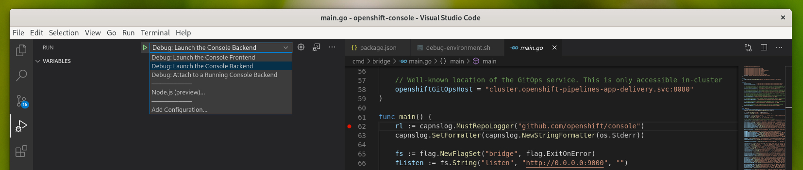
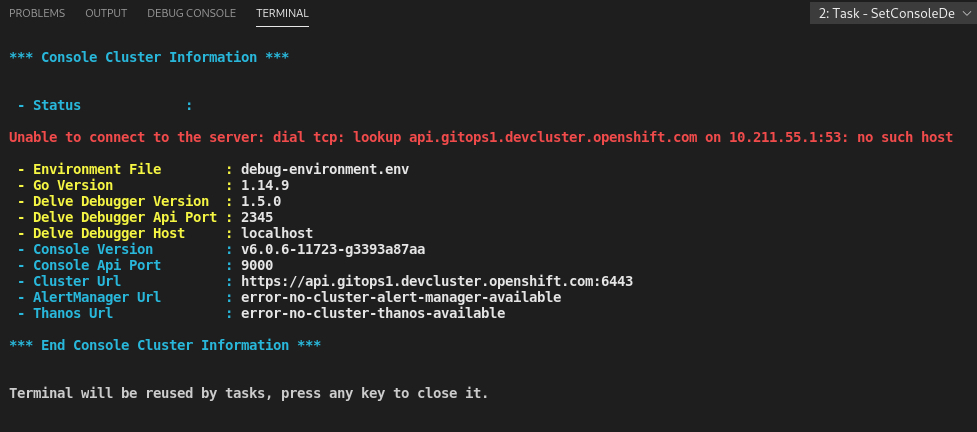

# Openshift Console Debugging
Debug shell script overlays to help debugging the [Openshift console](https://github.com/openshift/console) in VSCode.


# Instructions
- ## 1) Read [Debugging The Openshift Console](./docs/debugging/)
  > This information will help you to understand how go debugging works in both VSCode and the terminal, and how that information is used to setup integrated debugging for the openshift console.

- ## 2) Run the VSCode Debugging Setup Script
  >From the console VSCode <span style="color:red">**workspace folder**</span>, paste the following into a macOS Terminal or Linux shell prompt and press return. Its probably a good idea to do this on a seperate branch to ensure the scripts dont get checked into the master or primary branch.
  ```sh
  /bin/bash -c "$(curl -fSLO raw.githubusercontent.com/mitchharpur/openshift-console-debugging/master/debug-download.sh ; chmod u+x debug-download.sh ; )"; ./debug-download.sh;  ./debug-setup.sh


  ```
  The result or outcome of running this script will be debug drop down options in VSCode that will offer the options to launch the go console backend in debugging mode. By setting a break point in the go file, an integrated VSCode debugging experience will be possible. As long as a cluster has been logged into

  

  When debug run is pressed the VSCode integrated terminal will contain the information about the cluster that the console is connect to.

  


  - <span style="color:red;">***Note :***</span> You must be logged in to an openshift cluster. Get the login command with token from the user interface. It should resemble something similar to the following:
  ```sh
  oc login
  --token=7dDyxSKIumWvfkCWcwM_9A2vtwx8YiNEZsm9yyh-Ad0 --server=https://api.gitops2.devcluster.openshift.com:6443
  ```


