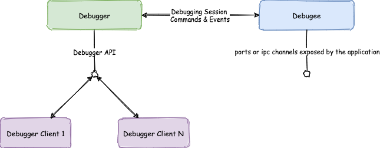

# Debugging The Console

## Debuggers
A debugger works by taking control of the execution of a process. The process being debugged could be an already running process or it could be one that is started by the debugger.

When a process is being debugged, it participates in a debugging session.The process being debugged is called the debuggee. In a debugging session the debugger is able to view and manipulate the state of the debuggee in addition to controlling its execution.

The debugger usually exposes an api that allows one or more debugger clients to interact with it. The debugger client could be a visual interface or a text based one. The debugger client issues commands using the debugger api in order to step through the debugee and view its state. This is how the VSCode IDE debugs go applications using the delve go debugger. Some debuggers also have a built in text interface that functions as a debugger client. This allows the debugger to also function as a debugger client in a debugging session.

[How debuggers work](https://opensource.com/article/18/1/how-debuggers-really-work)

## Considerations

There are several things to keep in mind when debugging

- In a debug session, the process being debugged is the called the **debugee** and the process performing the debugging is the **debugger**.
- Understanding the structure and run-time behavior of the application being debugged will help with debugging.
- Understand that there is a difference between attaching a debugger to a running application and launching a program in the debugging state. 
- Understand that it will be easier to debug a "go" application if it has been compiled with the correct options. When a debugger is attached to an already running binary, it is possible that the binary has been compiled with optimizations enabled. This will make it more difficult to debug. The binary may need to be recompiled with these optimizations disabled. 
- Using a debugger to launch a binary is typically easier to automate from within an IDE because it is not necessary to determine the process id (pid) to attach to.  For web applications, debugging is a little more complicated because the application is effectively Javascript running in a browser, and so launching vs attaching each have their own constraints depending on the browser being used. Typically debuggers will expose some kind of an API port that a debugger client can use to interface with the debugger. For example when you launch node with the --inspect switch, a node process listens at address 127.0.0.1:9229 for a debugging client. This api port has a protocol used to communicate breakpoints, code execution control statements etc. This is also true for browser-based debuggers. When attaching to a remote port, especially off-machine,there are security implications and infrastructure access considerations such as firewalls and access control policies.

