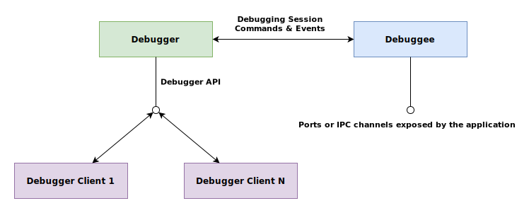

# A little about debuggers and debugging in general

## Sum of the parts

In order to inspect the run time state of a program, it is helpful to be able to control the runtime execution of the program and observe its state at any point during its execution. This is where a debugger proves useful. There are three parts neccesary to do enable this capability:

  - **Debuggee**
  The part being debugged. this could be an executable binary or a web script running in a browser.
  - **Debugger**
  The part that controls the execution of the debuggee.
  - **Debugger Client**
  The part that interacts with the user and enables the display of observed information.

These parts could be packaged up into one program, like the Chrome web browser that enables debugging javascript. Alternatively this could be split up into several cooperating programs that collectivly enable this capability. An example of this is the go Delve debugger that used by VSCode in the the [go extensions](https://marketplace.visualstudio.com/items?itemName=golang.Go).

## Debugger

A **debugger** operates by taking control of the execution and inspection of a process. The process being debugged could be an already running process or it could be one that is started by the debugger itself. The mechanism used to take control of a process for debugging relies on system level calls.
A debugger need not be a seperate executable. In the case of the chome browser, it is activated by a command line switch when it is launched. In the case of executable binaries, the debugger is typically a seperate program.
For more detail on how this works on a linux based machine, the following article outlines this for linux in more detail:[How debuggers really work](https://opensource.com/article/18/1/how-debuggers-really-work)

### Debuggee

When a process is being debugged, it participates in a debugging session. The process being debugged is called the **debuggee**. In a debugging session the **debugger** is able to view and manipulate the state of the **debuggee** in addition to controlling its execution.

### Debugger Client

A debugger usually exposes an **api** that enables one or more **debugger clients** to interact with it. This api is used to send debugging execution and inspection commands. It is also used to communicate the debuggee execution state to the client for display. The **debugger client** could be a visual interface or it could be a text based one at the terminal. Text based clients are useful when debugging over a remote connection using ssh or other cases where the debugger cannot have a user interface as a result of being on a remote machine. The **debugger client** issues commands using the debugger api in order to step through the debuggee and view its state, but the debugger is always the controlling agent. Note that if the debuggee exposes ports, that these ports are seperate to the port exposed by the debugger api. and thus need to have different values or there will be a clash.
Figure 1 illustrates the relationship between these mentioned entities.

##### Figure 1 : Debugger

### Examples
#### [VSCode](https://code.visualstudio.com/docs/editor/debugging) 
Consider how the VSCode IDE debugs go applications when using the [go extensions](https://marketplace.visualstudio.com/items?itemName=golang.Go). It simply functions as a debugger client to the go delve debugger. When stepping through code, it is issuing step commands through the exposed api of a headless delve debugger process.
#### [Node](https://nodejs.org/en/docs/guides/debugging-getting-started/)
In the case of a nodejs application, when you launch node with the --inspect switch, a node process listens at address 127.0.0.1:9229 for a debugging client.
#### [Chrome](https://marketplace.visualstudio.com/items?itemName=msjsdiag.debugger-for-chrome)
The VSCode chrome debugger also enables VSCode function as a debugger client when chrome is launched with remote debugging turned on. When remote debugging is turned on, the debugging api is accessible though port 9222 of the running chrome process

#### [Delve](https://github.com/go-delve/delve) and [GDB](https://www.gnu.org/software/gdb/)
Some debuggers also have a built in text interface that can also function as a debugger client. This allows the debugger to connect and communicate with another debugger instance through its api in a debugging session. This debugger process could be on the same machine or on another machine using ssh. 

## Considerations

There are several things to keep in mind when debugging

- In a debug session, the process being debugged is the called the **debugee** and the process performing the debugging is the **debugger**.
- Understanding the structure and run-time behavior of the application being debugged will help with debugging.
- Understand that there is a difference between attaching a debugger to a running application and launching a program in the debugging state. 
- Understand that it will be easier to debug a "go" application if it has been compiled with the correct options. When a debugger is attached to an already running binary, it is possible that the binary has been compiled with optimizations enabled. This will make it more difficult to debug. The binary may need to be recompiled with these optimizations disabled. 
- Using a debugger to launch a binary is typically easier to automate from within an IDE because it is not necessary to determine the process id (pid) to attach to.  For web applications, debugging is a little more complicated because the application is effectively Javascript running in a browser, and so launching vs attaching each have their own constraints depending on the browser being used. Typically debuggers will expose some kind of an API port that a debugger client can use to interface with the debugger. For example when you launch node with the --inspect switch, a node process listens at address 127.0.0.1:9229 for a debugging client. This api port has a protocol used to communicate breakpoints, code execution control statements etc. This is also true for browser-based debuggers. When attaching to a remote port, especially off-machine,there are security implications and infrastructure access considerations such as firewalls and access control policies.

