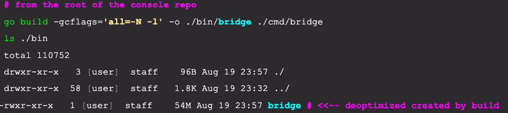

# Build with optimizations turned off

Before you use the delve debugger on a particular application,  it is important to remember that the Go compiler performs several optimizations that make it difficult to debug a program. 

These optimizations include things such as function inlining and registerization of variables (variables get stored in registers and not on the stack).

In order to disable these optimizations, the 

```bash
go build -gcflags=’all=-N -l’ -o ./bin/bridge ./cmd/bridge
``` 

option should be used when building an application that is to be part of a debugging session. 

These optimizations are automatically disabled when launching a debug session using the delve debug command. 

However, when using delve **attach** to attach to a running process, these optimizations should be disabled when building the binary as illustrated below :

>Note that the output binary is specifically specified, as is the folder with the source files containing the main package. 

