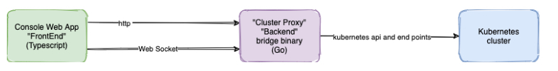
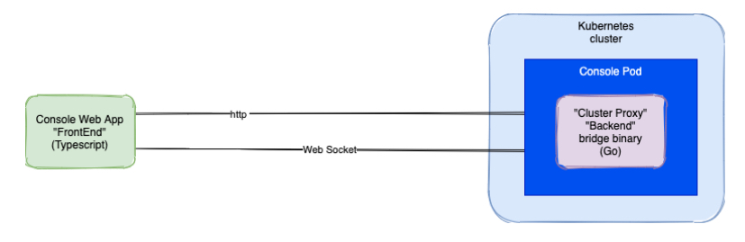

# Overview

The OpenShift console application is composed of three major subsystems, each with its own stack of technologies and sub-systems. A web application (aka **frontend**), a cluster proxy (aka **backend**) and a user selected **Kubernetes cluster**. 

When running on the developers desktop, the backend binary process exposes port 9000 by default and functions as an api endpoint to a static web application. The web application interacts with the backend endpoint using http and websocket traffic. These requests are then translated into requests to the openshift cluster

When the console is deployed to a cluster, it effectively runs in a pod, but more specifically as a [kubernetes operator](https://www.redhat.com/en/topics/containers/what-is-a-kubernetes-operator).

