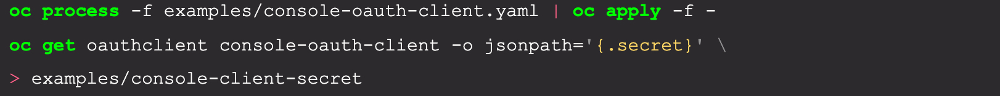
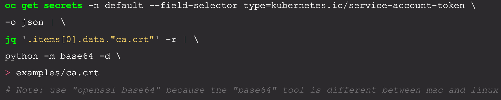
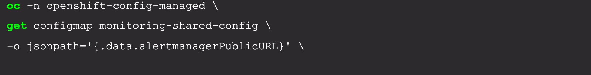

# Debugging go from the IDE

The steps in this section of the document can be automated by running the setup script outlined in the [openshift-console-debugging](https://github.com/mitchharpur/openshift-console-debugging) repo
## VS Code
The process of setting up VS Code as a [debugging client](https://code.visualstudio.com/docs/editor/debugging) can be reduced to automating the steps outlined in the [terminal debugging section](debugging-go-from-the-terminal). 

The go extensions for VS Code make use of the delve debugger, so all that is needed is a good way to parameterize the console debugging launch experience in order to reduce the number of steps. 

VS Code makes use of [tasks](https://code.visualstudio.com/docs/editor/tasks) defined in [tasks.json](https://code.visualstudio.com/docs/editor/tasks-appendix) and/or launch configurations in [launch.json](https://code.visualstudio.com/docs/editor/debugging#_launchjson-attributes) to integrate with external tools, including the ability to **launch** or **attach** to debuggers. These files are stored in the **.vscode** folder of a vscode workspace... typically the prrot folder of a project. 

Just as in the examples in previous sections, you can launch the debugger or you can attach the debugger to a running process. This section will outline how to set up these files so that debugging the backend and front end is just one click.

### VSCode Extensions and Plugins

Certain extensions are required in order to use VS Code as a debugger client
- VS Code Go Extension
  - [Install](https://marketplace.visualstudio.com/items?itemName=golang.Go)
  - [Repo](https://github.com/golang/vscode-go)

Several other extensions provide capabilities that make it easier to parameterize the debugger launch or attach scenarios using [variable substitution](https://code.visualstudio.com/docs/editor/debugging#_variable-substitution). The built in [predefined variables](https://code.visualstudio.com/docs/editor/variables-reference#_predefined-variables) and [input variables](https://code.visualstudio.com/docs/editor/variables-reference#_input-variables) available in VS Code are not quite sufficient to fully parameterise the shell scripts that will be launched. The reason for this is that setting environment variables in a shell script do not necessarily transfer to the calling parent script, and even though it is possible using the [bash source command](http://linuxcommand.org/lc3_adv_source.php), VS Code does not provide fine-grained control over this aspect of shell based tasks. At this point there is a need to transfer information between different running scripts and one of the simplest ways is to write to and read from shared files.

The ultimate goal is not to hard-code information such as ports, server names, secrets etc into the tasks.json and launch.json configuration files, but rather dynamically determine them at run time. This approach helps ensure that this information does not inadvertently get pushed into a shared git repository. As previously mentioned, a simple way to do this is to have one task run a shell script that writes to a file, such as an .env file. (remember to include these files in .gitignore). This information can then in turn be read by another task or extension. 

The following extensions provide capabilities to support this strategy.

- [VS Code Processes](https://github.com/weinand/vscode-processes) (optional): Show all child processes in VS Code in a custom view. This is helpful to see what executables are launched from the VS Code process.
  - [Repo](https://github.com/weinand/vscode-processes) (Note: this extension is not on the VSCode marketplace, so the extension needs to be compiled and installed from the produced vsix file)
- [Command Variable](https://marketplace.visualstudio.com/items?itemName=rioj7.command-variable) : Provides variable substitution using variables defined in an .env file (i.e key value pairs). This is helpful for when a bash script creates an env file, then these values can be read in.
  - [Repo](https://github.com/rioj7/command-variable)
- [DotENV](https://marketplace.visualstudio.com/items?itemName=mikestead.dotenv) : Support for .env file syntax highlighting . Useful for the readability of .env files
  - [Repo](https://github.com/mikestead/vscode-dotenv)
- [Tasks Shell Input](https://marketplace.visualstudio.com/items?itemName=augustocdias.tasks-shell-input) : Use shell commands as input for your tasks .This is helpful when determining the runtime pid of a process needing to be debugged. This extension will prompt the user to select the result of a shell script
  - [Repo](https://github.com/augustocdias/vscode-shell-command)

### Strategy

In order to parameterize the information required to compile and run and debug the bridge binary, the parameters must be identified. All the developer should need to do is to log in to the cluster. The implementation of this strategy could be one or more shell scripts that can be run as a unit. These scripts would be run when the user elects to debug the application from within VS Code.

#### Identify the parameters for the bridge binary

Based on what arguments are needed to launch the bridge executable, we determine the bridge parameters needed. These parameters are outlined in ./examples/run-backend.sh. The bash commands used were obtained from [quick start](https://github.com/openshift/console#quickstart) 

- **Web application base address**

  When running on the developer desktop, the address part of this value can be one of four values. Adding extra routes onto the address may be necessary (e.g localhost/web ) to get the web application to work in a cluster. This value gets prepended to  urls in the web application. The value corresponds to a [html base address](https://developer.mozilla.org/en-US/docs/Web/HTML/Element/base)
  - **localhost**: {port}
This may be the same as the loopback adapter, but sometimes it is configured to be something else.
  - **127.0.0.1**: {port} 
This address is the loopback or local-only interface/adapter. It is a fake network adapter that can only communicate within the same host.
  - **0.0.0.0**: {port}
This address means “listen on every available network interface and allow binding to all addresses”. The loopback adapter with address 127.0.0.1 , from the perspective of the process looks like any other network adapter on the machine , so a server listening on 0.0.0.0 will accept connections on the loopback adapter too.  In TCP stacks this is known as [INADDR_ANY](https://man7.org/linux/man-pages/man7/ip.7.html) . The main benefit of 0.0.0.0 over 127.0.0.1 from a debugging perspective is that you can connect to 0.0.0.0 from another computer using the machine ip address. This is helpful when using other proxy tools ([like charles proxy](https://www.charlesproxy.com/)) to intercept and troubleshoot traffic. Using 127.0.0.1 will not allow this scenario.
  - **machine-name**: {port}
This address is usually available in $HOSTNAME environment variable. 

- **Cluster endpoint**

Get the url of the currently logged in cluster.

- **Console Client Secret file**

Get the secret from the cluster and write it to the console-client-secret file.

- **Authentication Certificate Authority file**

Get the certificate from the cluster. Its contents are extracted using the [jason query utility](https://stedolan.github.io/jq/), and then written to the ca.crt file.
Note: This assumes that the [json query utility (jq)](https://stedolan.github.io/jq/) is installed i.e [brew install](https://brew.sh/) jq

- **Bridge api listen port**

The location and port that accepts api requests from the static web application. Default is 9000

- **[Alert Manager Url](https://www.openshift.com/blog/openshift-4-3-alertmanager-configuration)**

Get the url of the [alert manager](https://www.openshift.com/blog/openshift-4-3-alertmanager-configuration)

- **[Thanos Url](https://www.openshift.com/blog/thanos-long-term-storage-for-your-prometheus-metrics-on-openshift)**

Get the url of the thanos url. Thanos is long term storage for cluster metrics.

### Solution

Create a bash shell script that dynamically creates the environment representing the parameters needed to run the console bridge binary. The environment is a combination of setting environment variables and creating a corresponding environment file.  The script will be run as a vscode task that runs prior to running a vscode launch configuration. This environment file can be read using the [Command Variable extension](https://marketplace.visualstudio.com/items?itemName=rioj7.command-variable) using variable substitution into a vscode debug launch configuration .

  - #### [Solution Repo](https://github.com/mitchharpur/openshift-console-debugging)

  - #### Description of solution files:

    - ##### **debug-install-plugins.sh**
      Installs the requisite VSCode plugins used for debugging

    - ##### **debug-clean.sh**
      Removes all debug- files but not .vscode files as they may be pre-existing.

    - ##### **debug-download.sh**
      Downloads all the debug-* scripts and .vscode files. Old .vscode files are backed up

    - ##### **debug-environment.sh**
      Creates an environment file containing the serialized environment variables needed by bridge
    
    - ##### **debug-environment.env**
      The created environment file containing the debug environment parameters for the current debug session.

    - ##### **debug-get-cs-certificate.sh**
      Retrieve the certificate for the current logged in cluster and save it to ./examples/ca.crt

    - ##### **debug-get-oauth-secret.sh**
      Retrieves the api authentication secret and saves it to  ./examples/console-client-secret

    - ##### **debug-launch.sh**
      Compiles and launches bridge into a delve debug session that can be connected to from a debugger client
    
    - ##### **debug-connect.sh**
      Attaches to a delve debugger session as a terminal based debugger client.
    
    - ##### **.vscode/launch.json**
      The VS Code launch configuration
      - Configurations:
        ###### 1) **Debug**:
        Launch the Console Frontend
        ###### 2) **Debug**:
        Launch the Console Backend
        > Note that this has a **preLaunchTask** that creates/updates the environment file.
        ###### 3) **Debug**:
        Attach to a running console backend
        ###### 4) **Inputs**:
        The inputs listed below  are read out of the created debug-environment.env environment file
          - **consoleClusterUrl**
          - **consoleAlertManagerUrl**
          - **consoleThanosUrl**
          - **consoleHostName**
          - **consoleApiPort**
          - **debuggeeProcessId**
          Note: This input prompts the user to select the pid of a running bridge. It is not read out of the environment file.

    - ##### **.vscode/tasks.json**
      Tasks can be launched by cmd + shift + p
      See linux vscode shortcuts
      The VS Code tasks
      - ###### **LaunchConsoleDebugger**
      An independent task that launches the console

      - ###### **SetConsoleDebugEnvironment**
      The task that is called as a preLaunchTask in the launch configuration.

