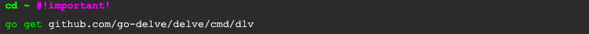

# Install Delve

[Delve](https://github.com/go-delve/delve) is a popular and widely used debugger for Go applications. It can function both as a debugger and a terminal debugger client. It was written by [Derek Parker](https://www.youtube.com/watch?v=InG72scKPd4) with [Go in mind](https://blog.gopheracademy.com/advent-2015/debugging-with-delve/). Instructions for installing the delve debugger can be found [here](https://github.com/go-delve/delve/tree/master/Documentation/installation). There are differences between mac, linux and windows, so carefully read the instructions.

>**Note: Remember to do the delve install from your home (~) directory in order to prevent making delve a dependency of your go application.** 

## Mac
The essence of the install command is shown below

```bash
cd ~ # this is important
go get github.com/go-delve/delve/cmd/dlv
```

 

To verify that the install was successful, check the version of delve that was installed. The output of the command should resemble the following:

 
