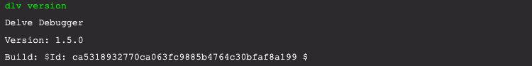

# Install Delve

[Delve](https://github.com/go-delve/delve) is a popular and widely used debugger for Go applications. It can function both as a debugger and a terminal debugger client. It was written by [Derek Parker](https://www.youtube.com/watch?v=InG72scKPd4) with [Go in mind](https://blog.gopheracademy.com/advent-2015/debugging-with-delve/). Instructions for installing the delve debugger can be found [here](https://github.com/go-delve/delve/tree/master/Documentation/installation). There are differences between mac, linux and windows, so carefully read the instructions.

>**Note: Remember to do the delve install outside of a module directory (~ is usually a good candidate for this) in order to prevent making delve a dependency of your go application.** 

## [Mac](https://github.com/go-delve/delve/blob/master/Documentation/installation/osx/install.md)
### 1. The go get method
The simplest and preferred method on a mac:

```bash
cd ~ # this is important : See note at the top of the page about installing deleve outside of a module directory.
go get github.com/go-delve/delve/cmd/dlv
# authorize the debugger if you did not enable Developer Mode in XCode
sudo /usr/sbin/DevToolsSecurity -enable
```


### 2. build from source for using the native backend
>** Note: Make sure to be aware of the difference on a mac vs linux. When using the deleve native backend, there are some [known problems](https://github.com/go-delve/delve/blob/master/Documentation/installation/osx/install.md)


## [Linux](https://github.com/go-delve/delve/blob/master/Documentation/installation/linux/install.md)
### 1. The go get method
The essence of the install command is shown below

```bash
cd ~ # this is important : See note at the top of the page about installing deleve outside of a module directory.
go get github.com/go-delve/delve/cmd/dlv
```
### 2. Build from source
```bash
# make sure that your GOPATH environment variable is a valid value. Typically ~/go
git clone https://github.com/go-delve/delve.git $GOPATH/src/github.com/go-delve/delve
cd $GOPATH/src/github.com/go-delve/delve
make install
```

# Verify the Delve installation
To verify that the install was successful, check the version of delve that was installed. The output of the command should resemble the following:

 
